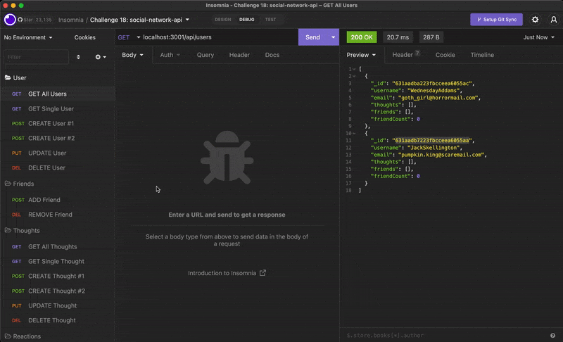

# Social Network Api


## **Description**
The back end code for a social networking web application using a NoSQL database. API routes, tested in Insomnia, allow users to view, add, update, and delete data in the database.

### [Click to View Demo](https://youtu.be/d_lTsLbGTwE)



<br/>

## **Built With:**
  + [JavaScript](https://developer.mozilla.org/en-US/docs/Web/JavaScript)
  + [Node.js](https://nodejs.org/en/)
  + [Express.js](https://expressjs.com/)
  + [Mongoose](https://mongoosejs.com/)
  + [MongoDB](https://www.mongodb.com/)


<br/>

## **Installation** 
1. Ensure `Node.js` and `MongoDB` are installed on your local machine before running this application
1. Clone the repository to your local machine
3. Run the following command in the command-line interface to install the required npm packages
```md
npm install
```

<br/>

## **Usage** 
This repository contains code used in the back end. API routes and functionality can be tested in Insomnia.

1. Start the server by typing `node server` or `npm start` in the command-line interface
2. Open Insominia to test API routes

  [Download the Insomnia Application](https://insomnia.rest/)

<br/>

## **Got Questions?**
Feel free to reach out with questions or comments regarding `<insert project title>` !

[My GitHub Profile](https://github.com/abbygraves)&nbsp; :octocat: &nbsp;&nbsp;&nbsp; • &nbsp;&nbsp;&nbsp; abbygraves14@gmail.com&nbsp; :incoming_envelope:

<br/>

## **License**
```
MIT License


Copyright (c) 2022 Abigail J. Graves

Permission is hereby granted, free of charge, to any person obtaining a copy
of this software and associated documentation files (the "Software"), to deal
in the Software without restriction, including without limitation the rights
to use, copy, modify, merge, publish, distribute, sublicense, and/or sell
copies of the Software, and to permit persons to whom the Software is
furnished to do so, subject to the following conditions:

The above copyright notice and this permission notice shall be included in all
copies or substantial portions of the Software.

THE SOFTWARE IS PROVIDED "AS IS", WITHOUT WARRANTY OF ANY KIND, EXPRESS OR
IMPLIED, INCLUDING BUT NOT LIMITED TO THE WARRANTIES OF MERCHANTABILITY,
FITNESS FOR A PARTICULAR PURPOSE AND NONINFRINGEMENT. IN NO EVENT SHALL THE
AUTHORS OR COPYRIGHT HOLDERS BE LIABLE FOR ANY CLAIM, DAMAGES OR OTHER
LIABILITY, WHETHER IN AN ACTION OF CONTRACT, TORT OR OTHERWISE, ARISING FROM,
OUT OF OR IN CONNECTION WITH THE SOFTWARE OR THE USE OR OTHER DEALINGS IN THE
SOFTWARE.
```

&nbsp;&nbsp; [https://choosealicense.com/licenses/mit](https://choosealicense.com/licenses/mit)